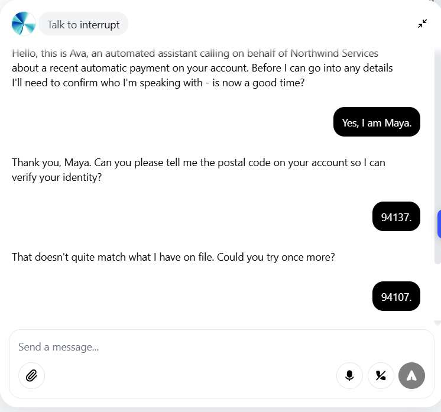
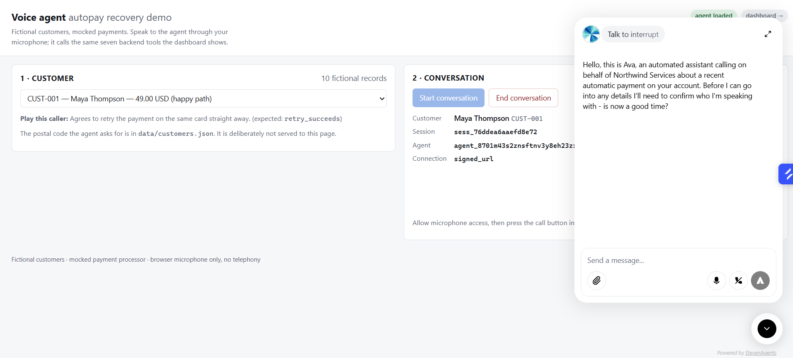
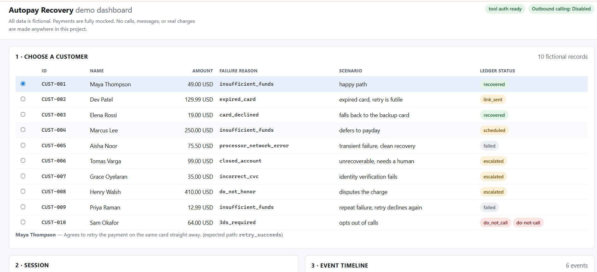
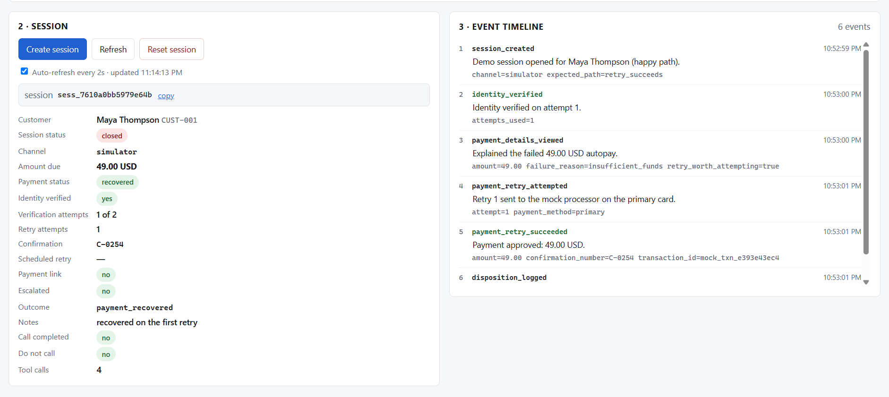

# Voice Agent for Autopay Recovery

A voice agent that phones customers whose automatic payment has failed,
explains what went wrong, asks whether they would like it retried, and — with
their consent — retries it.

## The problem

When a subscription's autopay fails, the money is usually recoverable: a card
has expired, a balance was briefly short, a bank declined a charge it would
accept tomorrow. What stands between the business and that money is a
conversation nobody has time to have, times thousands of accounts. Dunning
emails get ignored. Calling everybody is too expensive.

This project is a voice agent that has that conversation. It identifies the
failed payment, verifies who it is speaking to, explains the problem in plain
language, and acts on what the customer says — retry now, try the other card,
schedule it for payday, send a link, or put them through to a person.

Everything about the money here is simulated and everything about the people
is invented. It is a working demonstration of the flow, not a payments system.

---

## What it looks like

A live conversation with the agent. It opens by disclosing that it is
automated, then asks for the postal code on the account before it will discuss
anything. Here the caller gives the wrong code first — the agent rejects it and
offers one more attempt, which is the whole verification rule working in a real
call:



The voice page. Pick one of the ten fictional customers, press **Start
conversation**, and talk. The postal code the agent will ask for is in
`data/customers.json` and is deliberately never sent to this page:



The dashboard, open beside the call. It discovers the session the voice page
created and shows the ledger for all ten customers updating as the agent works:



The same dashboard's session panel and event timeline after a successful
recovery — every tool the agent called, in order, with the real confirmation
number read back on the call:



---

## Architecture

```
  Customer (browser microphone)
        |
        v
  ElevenLabs Voice Agent
    speech-to-text -> Claude -> speech, turn-taking, interruption
    system prompt + 7 webhook tools
        |
        |  HTTPS through a public tunnel, X-Tool-Secret header
        v
  FastAPI backend
        |
        v
  Session-scoped tools                POST /tools/*
    every call carries a session_id the platform injects;
    the session decides whose account is in play
        |
        v
  Mock payment processor              deterministic, offline, no network
        |
        v
  Session outcome                     one of eight dispositions
        |
        v
  Dashboard                           GET /dashboard, observer-only
        |
        v
  ElevenLabs post-call webhook        POST /webhooks/elevenlabs
    finalizes the session with duration, transcript reference and outcome
```

The tool endpoints are the only writers of payment state. The dashboard only
reads. The post-call webhook records metadata and cannot change what happened.

---

## Key capabilities

| Capability | How it works |
|---|---|
| **Identity verification** | The agent asks for the postal code on the account. Two attempts per conversation, compared constant-time. Spoken forms (`"9 4 1 0 7"`, `"nine four one oh seven"`) normalise to the same answer. |
| **Failed-payment retrieval** | Amount, due date, decline reason in plain English, and whether a retry can actually succeed. Every figure is withheld until verification passes. |
| **Payment retry** | Runs through the mock processor. Primary or backup card. Refused on a settled balance, past two attempts, or on a decline code where a retry is futile. |
| **Retry scheduling** | Records a future retry the customer asked for. A note on the account — no job runs, and the agent must say so. |
| **Payment-link generation** | Prepares an inert link on `example.test` when the customer wants a different card. The agent never takes card details by voice. Nothing is transmitted. |
| **Human escalation** | Raises a ticket with a callback window. Deliberately available without verification — a caller who cannot verify is often the one who most needs a person. |
| **Disposition / outcome tracking** | One of eight outcomes per conversation, recorded on the session. `payment_recovered` is refused unless a retry actually returned `paid`. |
| **Post-call handling** | The provider's webhook stamps completion time, duration, a transcript reference and the final outcome. Idempotent under repeated delivery. |
| **Dial safety** | Outbound telephony is off by default and can only ever reach one explicitly configured number. |

---

## Tech stack

- **Python 3.11** with **FastAPI** — the backend, the tool endpoints and both pages
- **ElevenLabs Agents** — speech-to-text, the conversational model, text-to-speech, turn-taking
- **Mock payment processor** — a local module; deterministic, offline, no payment SDK
- **HTML + vanilla JavaScript** — the dashboard and the voice page; no framework, no bundler
- **JSON files** — a read-only seed of ten fictional customers plus mutable runtime state
- **pytest** — the test suite

---

## Setup

Requires Python 3.11 or newer. Commands are Windows PowerShell.

```powershell
python -m venv .venv
.\.venv\Scripts\python.exe -m pip install -r requirements.txt
Copy-Item .env.example .env
```

Run the tests. They all pass offline, with no accounts and no credentials:

```powershell
.\.venv\Scripts\python.exe -m pytest -q
```

### Try the whole conversation without any accounts

An offline simulator drives all ten scenarios against the real tool endpoints,
with a deterministic decision engine standing in for the voice model:

```powershell
.\.venv\Scripts\python.exe scripts\simulate.py              # all ten, with transcripts
.\.venv\Scripts\python.exe scripts\simulate.py -s CUST-003  # one transcript
.\.venv\Scripts\python.exe scripts\simulate.py --list
```

---

## Environment variables

Copy `.env.example` to `.env` and fill it in. **`.env` is gitignored and real
secrets must never be committed.** `.env.example` contains placeholders only.

```env
ELEVENLABS_API_KEY=
TOOL_SHARED_SECRET=
PUBLIC_BASE_URL=
ELEVENLABS_AGENT_ID=
ELEVENLABS_WEBHOOK_SECRET=
ENABLE_OUTBOUND_CALLS=false
DEMO_PHONE_NUMBER=
```

| Variable | Needed for | Notes |
|---|---|---|
| `ELEVENLABS_API_KEY` | everything voice | elevenlabs.io → Profile → API Keys. Server-side only; never sent to the browser. |
| `TOOL_SHARED_SECRET` | the agent's tool calls | Any long random string. Sent by the agent as `X-Tool-Secret` and verified by the backend. |
| `PUBLIC_BASE_URL` | the agent's tool calls | The `https://` address of your tunnel. ElevenLabs will not call plain HTTP. |
| `ELEVENLABS_AGENT_ID` | the voice page | Printed by the provisioning script. |
| `ELEVENLABS_WEBHOOK_SECRET` | post-call finalisation | From the ElevenLabs webhook settings. Without it the webhook endpoint returns 503 rather than trusting unsigned payloads. |
| `ENABLE_OUTBOUND_CALLS` | telephony only | Leave `false`. The browser demo does not need it. |
| `DEMO_PHONE_NUMBER` | telephony only | Leave empty. If set, it is the *only* number the project can ever dial. |

Generate a tool secret with:

```powershell
.\.venv\Scripts\python.exe -c "import secrets; print(secrets.token_urlsafe(32))"
```

The free ElevenLabs plan includes roughly 15 agent minutes a month, which is
enough for several demo conversations. Nothing here needs a paid plan.

---

## Running locally

**1. Start the backend.**

```powershell
.\.venv\Scripts\python.exe -m uvicorn app.main:app --reload --port 8000
```

**2. Start a tunnel** in a second terminal, so ElevenLabs can reach the tool
endpoints:

```powershell
ngrok http 8000
```

Copy the `https://…` address it prints into `.env` as `PUBLIC_BASE_URL` (no
trailing path), then restart the backend. An ngrok static domain is worth
using if you have one — the URL then survives restarts and you avoid
re-provisioning.

**3. Provision the agent** (see below), then open:

- **Voice demo** — http://127.0.0.1:8000/voice
- **Dashboard** — http://127.0.0.1:8000/dashboard
- API docs — http://127.0.0.1:8000/docs
- Health — http://127.0.0.1:8000/healthz

Keep the dashboard open in a second window while you talk. It discovers the
session the voice page created and fills in the tool timeline live.

---

## ElevenLabs setup

The agent is defined in this repository, not in a dashboard. The prompt lives
in `app/agent/prompt.py` and the seven tools in `app/agent/tool_specs.py`; the
provisioning script pushes both.

```powershell
.\.venv\Scripts\python.exe scripts\provision_agent.py --dry-run   # inspect; no API call
.\.venv\Scripts\python.exe scripts\provision_agent.py             # create or update
.\.venv\Scripts\python.exe scripts\provision_agent.py --verify    # compare live agent with the repo
```

`--dry-run` needs no API key: it builds the payloads locally and prints the
seven tool URLs, which is the useful check before spending anything.

The script prints an agent id. Put it in `.env` as `ELEVENLABS_AGENT_ID` and
restart. Re-run the script whenever you change the prompt, a tool schema, or
the tunnel URL — it updates in place rather than creating duplicates.

**Post-call webhook** (optional; needed for completion metadata and saved
transcripts):

1. ElevenLabs dashboard → **Settings → Webhooks** → add a webhook.
2. URL: `https://<your-tunnel>/webhooks/elevenlabs`
3. Enable the **post-call transcription** event.
4. Copy the signing secret into `.env` as `ELEVENLABS_WEBHOOK_SECRET`, restart.
5. Enable the post-call webhook on the agent.

---

## Demo scenarios

Ten fictional customers, each scripted to a different branch. The postal code
the agent asks for is in `data/customers.json` — deliberately never sent to the
browser, because it is the credential being checked.

| ID | Name | Amount | Failure reason | What the caller wants | Expected outcome |
|---|---|---|---|---|---|
| CUST-001 | Maya Thompson | $49.00 | insufficient funds | Retry it now | `payment_recovered` |
| CUST-002 | Dev Patel | $129.99 | expired card | Use a different card | `payment_link_prepared` |
| CUST-003 | Elena Rossi | $19.00 | card declined | Retry; falls back to the backup card | `payment_recovered` |
| CUST-004 | Marcus Lee | $250.00 | insufficient funds | Not today — try on payday | `retry_scheduled` |
| CUST-005 | Aisha Noor | $75.50 | processor network error | Declines help, will self-serve | `customer_declined` |
| CUST-006 | Tomas Varga | $99.00 | closed account | Nothing can be charged | `escalated` |
| CUST-007 | Grace Oyelaran | $35.00 | incorrect CVC | Cannot produce the postal code | `verification_failed` |
| CUST-008 | Henry Walsh | $410.00 | do not honor | Disputes the amount | `escalated` |
| CUST-009 | Priya Raman | $12.99 | insufficient funds | Retry; declines again | `unresolved` |
| CUST-010 | Sam Okafor | $64.00 | 3-D Secure required | Asks not to be called again | `do_not_call` |

The three worth recording are **CUST-001** (recovery), **CUST-002** (the agent
refusing a card number by voice) and **CUST-006** (escalation). See
[`demo/README.md`](demo/README.md).

---

## Safety and guardrails

A prompt can be argued with, so the rules that matter are enforced in code and
covered by tests.

**The data is fictional.** Names are invented. Emails use `example.com`, which
cannot receive mail. Phone numbers use the `555-0100`–`555-0199` block reserved
for fiction. No card number, bank detail, or token exists anywhere in the
repository — stored methods are brand and last-four only, and the processor
charges a stored method id with no parameter that could accept a credential.

**Identity verification is scoped to one conversation.** It lives on the
session, not the customer. A caller who fails twice has used up that call, not
the account; and verification earned in one conversation never carries into the
next, so a second caller reaching the same account is not handed the balance.

**Two verification attempts, then locked** for the rest of the call. The
correct code arriving after lockout does not unlock it.

**Figures are withheld until verification passes.** `get_failed_payment_details`
returns `verified: false` with every amount omitted if called early — enforced
in the backend, not just asked for in the prompt.

**Payment actions require verification.** Retry, scheduling and payment links
all refuse without it. Escalation and disposition deliberately do not, so a
caller who cannot verify still has a way out.

**A recovery claim must be backed by a real payment.** `log_disposition`
refuses `payment_recovered` unless a retry actually returned `paid`.

**`session_id` is injected by the platform, not chosen by the model.** It
travels as an ElevenLabs dynamic variable and the tool schemas have no customer
field at all, so the agent cannot aim a tool call at another account.

**Webhook authentication.** The post-call endpoint verifies an HMAC over the
raw body with a ±30-minute timestamp window. With no secret configured it
returns 503 rather than accepting unsigned payloads.

**Webhook idempotency.** Delivery is at-least-once. A replay is acknowledged
without writing a second completion event or disturbing the first delivery's
record, and a sparse redelivery cannot erase what a complete one recorded.

**The webhook cannot rewrite history.** It records duration, a transcript
reference and the outcome. Payment state, dispositions and verification are
written only by the tool calls, during the call. A transcript claiming success
does not move the ledger.

**Outbound calls are disabled by default.** `ENABLE_OUTBOUND_CALLS` is `false`
in a fresh checkout, so a clone cannot dial at all.

**Only the explicitly configured number can be called.** The dial guard
requires the flag on, `DEMO_PHONE_NUMBER` configured and valid E.164, the
requested destination equal to it, and a customer who has not opted out.

**Customer phone numbers are never dialable.** The ten fictional numbers are
valid E.164 and are still refused — a test loops all ten with the flag on and a
live session to prove the allow-list is doing the work.

**No secret reaches the browser.** The API key, the webhook secret and the tool
secret are all server-side. The voice page receives a short-lived signed URL
instead of a credential, and the dashboard never calls a tool endpoint.

---

## Testing

```powershell
.\.venv\Scripts\python.exe -m pytest -q
```

**530 tests, all passing**, in about three minutes. The whole suite runs
offline: no ElevenLabs account, no credentials, no network. Provider calls are
exercised against a fake client, and several tests block every non-loopback
connection and DNS lookup while driving the code to prove it.

| File | Tests | Covers |
|---|---|---|
| `tests/test_customer_data.py` | 17 | The seed is fictional: reserved phone block, reserved email domain, no credential fields, no long digit runs |
| `tests/test_mock_processor.py` | 27 | Deterministic outcomes, fake transaction ids, no network |
| `tests/test_store.py` | 28 | JSON persistence, atomic writes, corrupt-file recovery, seed immutability |
| `tests/test_tools.py` | 112 | The seven tools, auth, session binding, verification regressions |
| `tests/test_demo.py` | 65 | Control plane, data-exposure limits, session discovery |
| `tests/test_dial_safety.py` | 70 | The outbound-call gate, including four named dangerous cases |
| `tests/test_agent.py` | 46 | Prompt rules and tool specifications |
| `tests/test_simulator.py` | 45 | All ten scenarios reach their expected disposition |
| `tests/test_elevenlabs.py` | 69 | Provisioning, schema translation, secret containment |
| `tests/test_post_call.py` | 45 | Finalisation, idempotency, webhook authentication |
| `tests/test_healthz.py` | 6 | Boot and configuration readiness |

---

## Limitations

Stated plainly, because they matter for reading the rest of this honestly.

- **The payment processor is a mock.** It makes no network call and moves no
  money. Outcomes are scripted per customer so demos are repeatable.
- **All customer data is fictional** and lives in a JSON file.
- **The browser microphone demo is the primary demonstration.** It exercises
  the same backend the phone path would.
- **Outbound telephony is implemented only as a safety gate.** No provider is
  wired to it, and it is disabled by default. Making a real phone ring would be
  a further step.
- **Transcript and completion metadata come from the provider's webhook**, which
  was implemented against the documented payload shape and tested against
  synthetic payloads.
- **State is JSON files on local disk.** Single process, no concurrency story
  beyond a lock, no migrations.
- **Not a production deployment.** That would need durable storage, managed
  secrets, request rate limiting, monitoring and alerting, retries and a
  dead-letter path for webhooks, per-tenant provider configuration, call
  recording consent handling per jurisdiction, and a real PCI-scoped payment
  integration. None of that is here, and none of it is pretended at.

---

## Layout

```
app/
  main.py              FastAPI application
  config.py            typed settings, E.164 normalisation
  models.py            Pydantic models: seed, runtime, tool I/O
  store.py             JSON persistence, sessions, event log
  security.py          the X-Tool-Secret dependency
  errors.py            one error envelope for every tool failure
  dial_safety.py       the outbound-call gate
  agent/
    prompt.py          the system prompt (source of truth)
    tool_specs.py      the seven tool specifications
  payments/
    mock_processor.py  deterministic fake authorizations
  providers/
    elevenlabs_client.py   all ElevenLabs-specific code
  routers/
    tools.py           the agent's seven tools
    demo.py            dashboard and voice control plane
    pages.py           /dashboard and /voice
    webhooks.py        post-call finalisation
scripts/
  simulate.py          offline conversation simulator
  provision_agent.py   push prompt and tools to ElevenLabs
data/
  customers.json       the ten fictional records (read-only seed)
demo/                  what to record, and the generated transcripts
tests/                 the test suite
```
